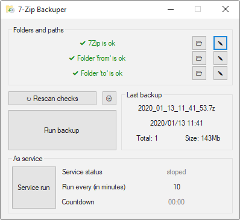

## 7zBackuper
Purpose: create small program with GUI for backup creation.  
This program depends on [7-zip](https://www.7-zip.org/) archiver and working through CLI of `7z.exe` file. Inspired by [this article](https://habr.com/ru/post/72636/).  

You can run this program in background. It will be create backup periodically and cleanup folder according with options in `options.ini` file. 

## Features
*  Run backup by button
*  Cleanup folder from old files
*  Execution in background
*  Check information about last backup (datetime creation, size)
*  Countdown timer for background task
*  Notification of backup creation

## License
MIT